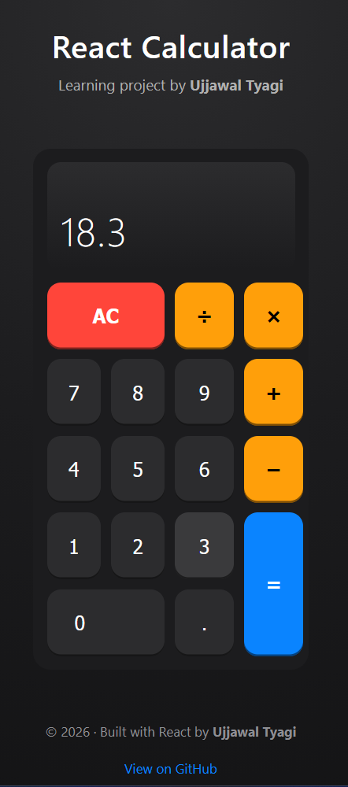

# React Calculator 🧮

A simple calculator built using **React** as a learning project.

This project focuses on:
- React components
- State management with hooks
- Event handling
- UI/UX styling with CSS

---

## 🚀 Live UI

---

## 🛠️ Tech Stack

- React
- JavaScript (ES6+)
- CSS (Flexbox & Grid)

---

## ✨ Features

- Basic arithmetic operations
- Decimal handling
- Operator replacement logic
- Responsive design
- Clean and modern UI

---

## 📚 Learning Goals

- Understanding React state and events
- Structuring reusable components
- UI/UX with pure CSS

---

## 👤 Author

**Ujjawal Tyagi**

- GitHub: [https://github.com/ujjawaltyagi](https://github.com/ujjawaltyagi)

---

## 📄 License

This project is open-source and intended for learning purposes.
